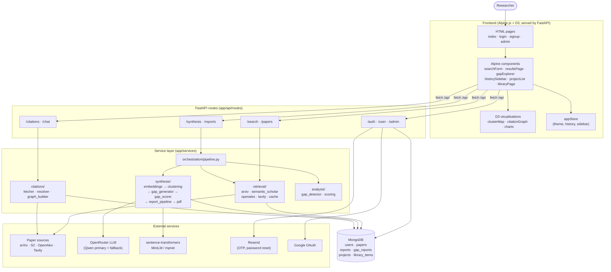
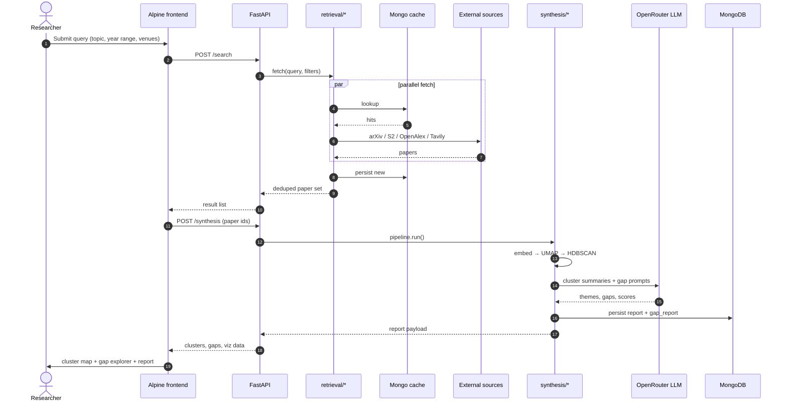

# Literature Assistant

An AI-assisted literature review and research-gap detection platform. Researchers describe a topic, and the agent fans out across multiple paper sources, clusters the results into thematic regions, scores the gaps between them, and renders the landscape as an interactive map alongside a synthesised report.

Built with **FastAPI + MongoDB** on the backend and **Alpine.js + D3** on the frontend, served as a single Python process — no bundler, no separate frontend build.

---

## Highlights

- **Multi-source retrieval** — arXiv, Semantic Scholar, OpenAlex, and Tavily fetched in parallel, normalised and deduplicated through a shared cache.
- **Synthesis pipeline** — sentence-transformer embeddings → UMAP dimensionality reduction → HDBSCAN clustering → LLM-driven gap generation and scoring.
- **Interactive literature map** — D3 force layout with topographical hulls so thematic clusters and inter-cluster gaps are visible at a glance.
- **Citation graph** — directed graph view of how papers in your result set cite each other.
- **Reports** — synthesis output is persisted, shareable via URL, and exportable as PDF.
- **Projects & library** — save runs into projects, bookmark papers, and resume later.
- **Auth** — email/password with OTP verification, Google OAuth, password reset via Resend, and an admin panel. A dev bypass flag is available for localhost work.

---

## Architecture



### Request flow — a typical search



---

## Tech stack

**Backend**
- FastAPI 0.135 + Uvicorn
- Motor (async MongoDB) on PyMongo 4.16
- python-jose + passlib (argon2) + bcrypt for auth
- sentence-transformers, UMAP, HDBSCAN for the synthesis pipeline
- ReportLab + Matplotlib + Plotly for PDF and chart export
- Celery + Redis (background work, optional)
- Anthropic SDK / OpenRouter HTTP for LLM calls

**Frontend** *(no bundler — vanilla `<script>` tags, order in `index.html` matters)*
- Alpine.js 3 + `@alpinejs/collapse` for reactive UI
- D3 v7 (`d3-shape`) for the cluster map and citation graph
- Vanilla CSS with a token-based design system (`tokens.css` → `style.css` / `workspace.css` / `dashboard.css`)
- Playwright for end-to-end tests

---

## Project layout

```
research-agent/
├── app/                          # FastAPI backend
│   ├── main.py                   # App + route registration + static mounts
│   ├── api/routes/               # auth, user, admin, papers, search,
│   │                             # synthesis, reports, citations, chat,
│   │                             # projects, library, feedback
│   ├── db/session.py             # Motor connection + collection handles
│   ├── models/                   # Pydantic schemas (Mongo is schemaless)
│   └── services/
│       ├── retrieval/            # arxiv, semantic_scholar, openalex,
│       │                         # tavily, cache, fetcher
│       ├── synthesis/            # embeddings, clustering, gap_generator,
│       │                         # gap_scorer, pattern_analysis,
│       │                         # report_pipeline, visualization, pdf
│       ├── citations/            # fetcher, resolver, graph_builder
│       ├── analysis/             # gap_detector, scoring, normalization
│       ├── extraction/           # normalizer
│       └── orchestration/        # pipeline.py
├── frontend/
│   ├── html/                     # index, login, signup, verify-otp,
│   │                             # forgot-password, reset-password, admin
│   ├── js/
│   │   ├── alpine/
│   │   │   ├── stores/appStore.js
│   │   │   └── components/       # searchForm, resultsPage, gapExplorer,
│   │   │                         # historySidebar, projectList, libraryPage,
│   │   │                         # citationGraph
│   │   └── d3/                   # clusterMap, citationGraph, charts
│   └── css/                      # tokens, style, workspace, dashboard
├── tests/                        # pytest suites (recommendations, …) + e2e/
├── Dockerfile                    # Python 3.12 slim, uv-based, non-root
├── docker-compose.yml            # app + mongo:7 for local dev
├── .dockerignore
├── .github/workflows/ci.yml      # lint · pytest · docker build smoke · e2e
├── requirements.txt              # UTF-16, not used — see note in Setup
├── pyproject.toml / uv.lock
├── package.json                  # frontend deps + Playwright
└── playwright.config.js
```

---

## Getting started

The fastest path is **Docker Compose**. If you want hot-reload while developing the Python code, use the manual setup below.

### Prerequisites
- A MongoDB instance — Atlas, or the Mongo service spun up by `docker compose` below
- API keys for the paper sources and LLM provider you intend to use (see [Environment variables](#environment-variables))
- For Docker: Docker Engine 24+ with the Compose plugin
- For manual setup: Python 3.12, Node.js 20+ (only for Playwright), and [`uv`](https://docs.astral.sh/uv/) installed

### Quickstart with Docker

`docker compose up --build` boots the FastAPI app on `:8000` and a local MongoDB on `:27017` (volume-backed) in one step.

```bash
git clone git@github.com:jyoti-pokhrel/research-agent.git
cd research-agent

cp .env.example .env            # fill in API keys; MONGODB_URL is overridden
                                # automatically inside the compose network
docker compose up --build
```

Then open:
- `http://localhost:8000/workspace` — main app
- `http://localhost:8000/docs` — interactive OpenAPI docs

Stop the stack with `docker compose down`. To wipe the local Mongo volume, `docker compose down -v`.

The image is also runnable standalone if you already have a Mongo URL:

```bash
docker build -t research-agent .
docker run --rm -p 8000:8000 --env-file .env research-agent
```

### Manual setup (hot-reload)

```bash
git clone git@github.com:jyoti-pokhrel/research-agent.git
cd research-agent

# Python deps — uv reads pyproject.toml + uv.lock for reproducible installs.
uv sync

# Frontend tooling — Alpine and D3 load via CDN, so npm is only needed for
# Playwright (and for vendoring deps if you want offline use).
npm install

cp .env.example .env
$EDITOR .env                    # fill in MongoDB URL + API keys
```

Run the server with reload:

```bash
uv run uvicorn app.main:app --host 0.0.0.0 --port 8000 --reload
```

Then open `http://localhost:8000/workspace`.

> ⚠️ **`requirements.txt` is currently UTF-16 encoded** and unreadable by `pip install -r`. Use `uv sync` (it reads `pyproject.toml` + `uv.lock`). Regenerate the txt with `uv pip compile pyproject.toml -o requirements.txt` if you need it for another tool.

### Tests

Python unit tests run against a real Mongo (the CI workflow spins one up as a service container). Locally, point `MONGODB_URL` at any Mongo and:

```bash
uv run pytest tests/ -q                  # all Python tests
uv run pytest tests/recommendations/ -q  # just the recommendations suite

npm run test:e2e                         # Playwright (specs live in tests/e2e/)
```

---

## Environment variables

See `.env.example` for the full list. The required ones:

| Variable | Purpose |
| --- | --- |
| `MONGODB_URL`, `DB_NAME` | MongoDB connection (Atlas or local) |
| `OPENROUTER_API_KEY` | LLM provider for synthesis / gap generation |
| `MODEL_NAME`, `SYNTHESIS_MODEL_PRIMARY`, `SYNTHESIS_MODEL_FALLBACK` | LLM model IDs |
| `EMBEDDING_MODEL`, `EMBEDDING_FALLBACK_MODEL` | sentence-transformers model names |
| `SECRET_KEY`, `ALGORITHM`, `ACCESS_TOKEN_EXPIRE_MINUTES` | JWT settings |
| `SEMANTIC_SCHOLAR_API_KEY`, `TAVILY_API_KEY`, `OPENALEX_API_KEY` | Optional, but raise rate limits |
| `RESEND_API_KEY`, `EMAIL_FROM` | OTP + password-reset emails (logged to stdout if empty) |
| `GOOGLE_CLIENT_ID`, `GOOGLE_CLIENT_SECRET`, `GOOGLE_REDIRECT_URI` | Google OAuth |
| `FRONTEND_URL`, `BACKEND_URL` | Used in email links and OAuth redirect |
| `AUTH_DEV_BYPASS` | `1` returns a synthetic admin user when `Authorization` is missing — convenient for localhost, do not enable in production |

---

## Conventions and gotchas

- **MongoDB, not SQL.** Pydantic models in `app/models/` are validation schemas, not ORM classes — don't reach for SQLAlchemy patterns.
- **Adding a collection** requires declaring it in `app/db/session.py`. Routes that reference an undeclared collection will 500.
- **Auth dev bypass** is on by default in `.env.example`. Turn it off in any non-localhost deployment.
- **Frontend script order matters.** No bundler — `index.html` loads scripts as plain `<script>` tags in the order they need to initialise.
- **localStorage keys are versioned** (e.g. `research-agent-sidebar-collapsed-v2`). Bump the version when you want to reset stored user prefs.
- **Tests live in `tests/`.** Python tests under `tests/recommendations/` (pytest + pytest-asyncio); Playwright specs under `tests/e2e/`.

---

## Continuous integration

`.github/workflows/ci.yml` runs on every push and PR to `main` / `develop`:

| Job | What it does |
| --- | --- |
| **lint** | `ruff check` and `ruff format --check` on `app/` and `tests/`. |
| **test** | `pytest tests/` against a real MongoDB service container. |
| **docker** | Builds the image with Buildx + GHA cache and runs a container smoke test (boots the app and waits for it to respond on `:8000`). |
| **e2e** | Manual-only (`workflow_dispatch` with `run_e2e=true`): boots the API + Mongo and runs Playwright. Uploads `playwright-report/` as an artifact. |

---

## License

Unlicensed — internal/research project.
